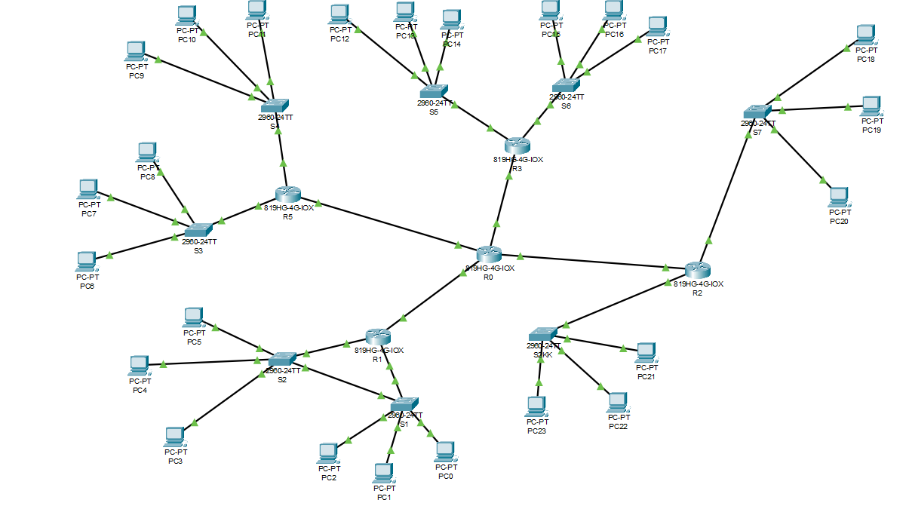

# 🧠 Analisador de Pontos Críticos em Redes de Comunicação
##
<p align="center">
  
</p>

## 1-👥 Integrantes
- **ANTÔNIO FELIPE COSTA DE FREITAS**
- **JOÃO VITOR DE ALMEIDA SILVA** 


## 2-📋 Descrição do Projeto
Este projeto foi desenvolvido para a disciplina **ESTRUTURA DE DADOS AVANÇADA - UNIVERSIDADE ESTADUAL DO MARANHÃO**.  
O objetivo é **analisar redes de comunicação** representadas por grafos não-dirigidos, permitindo verificar conexões entre roteadores e identificar **pontos críticos (vértices de articulação)** cuja falha pode desconectar partes da rede.

O projeto utiliza uma **lista de adjacência** como estrutura de dados principal, oferecendo operações básicas de manipulação de grafos e **visualização gráfica** com a biblioteca `NetworkX`.


## 3-⚙️ Funcionalidades Implementadas
- Leitura de um grafo a partir de um arquivo `.txt`
- Construção de **lista de adjacência**
- Impressão da estrutura do grafo
- Verificação de **adjacência** entre dois vértices
- Cálculo do **grau de um vértice**
- Listagem de **vizinhos**
- Exibição de **todas as arestas**
- **Plotagem visual** do grafo com `NetworkX` e `Matplotlib`


## 4-🧩 Estrutura do Projeto
```text
Analisador de Pontos Criticos

─ grafo 1.txt   # Arquivo de entrada do grafo
─ grafo.py      # Implementação principal com lista de adjacência
─ README.md     # Este arquivo
```

## 5-📄 Exemplo de Arquivo de Entrada (`grafo 1.txt`)
```text
ND
S1 PC0
S1 PC1
S1 PC2
S1 R1
S2 PC3
S2 PC4
S2 PC5
S2 R1
S3 PC6
S3 PC7
S3 PC8
S3 R4

R0 R1
R0 R2
R0 R3
R0 R4
```
A primeira linha indica o **tipo do grafo**:
- ND → Não-dirigido    
- As linhas seguintes representam as **arestas** (conexões entre os vértices).


## 6-▶️ Como Executar o Projeto
O arquivo compactado enviado contém os seguintes itens:
-README.md → Este arquivo de instruções.
-grafo 1.txt → Arquivo de entrada contendo o grafo a ser lido e processado.
-grafo.py → Codigo com todas as funções basicas e o algoritimo principal de identificação de pontos criticos de uma rede de comunicação
-main.py → Contem o menu principal e todas as chamadas das funções que estao no grafo.py
-main.exe → Versão executável do programa para Windows.

Para garantir o funcionamento correto do programa:

6.1- Extraia todos os arquivos do .zip.
<br>
6.2- Coloque todos os arquivos na mesma pasta — isso fará que localize corretamente os arquivos .py e o arquivo de grafo (grafo 1.txt).
executando o projeto
<br>
🪟 Método 1 — Via executável (recomendado)
```text
-Localize o arquivo main.exe.
-Clique com o botão direito sobre ele.
-Selecione “Executar como administrador”.
-O programa será iniciado e fará uso automático dos arquivos da pasta.
```
🪟 Método 2 — Via código-fonte (opcional)
Caso prefira rodar o código em Python:
```text
-É necessário ter o Python 3.10+ instalado em seu sistema.
-clique com o botão direito na pasta e escolha a opção “Abrir no Terminal”
-Execute o programa com o comando: 'python main.py'
```

Sobre o arquivo 'grafo 1.txt':
Esse arquivo contém os dados que representam o grafo usado pelo programa, você pode editar o conteúdo dele a partir de um bloco de notas ou a partir de qualquer programa que abra um arquivo txt.
💡 Observação: É importante executar como administrador para evitar possíveis restrições de acesso a arquivos ou diretórios.

## 7-🖼️ Visualização
O programa gera uma visualização da rede mostrando:
- **Nós**: roteadores, switches e PCs.
- **Arestas**: conexões entre eles.  
- O grafo é desenhado automaticamente em uma janela interativa.
